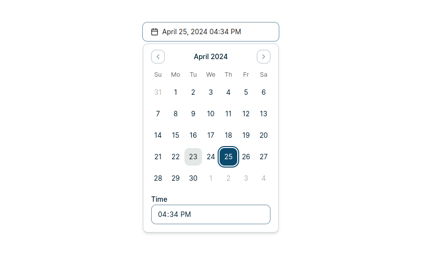

## DateTimePicker Component

The DateTimePicker component is a React component that allows users to select a date and time value. It combines a calendar view for selecting the date and an input field for selecting the time.

## Prerequisites

Make sure you've added this repository as submodule in your codebase. Follow [this](https://github.com/voidCounter/wels-ui?tab=readme-ov-file#prerequisite) to do so. If you have done already, then just pull the changes:

```bash
cd wels-components
git checkout main
git pull
```

### Dependencies

1. `luxon`: For managing dates and times, `react-day-picker` , `lucide-react` for using icons.

```bash
 npm install --save luxon react-day-picker lucide-react
```

2. Add Shadcn components:

```bash
npx shadcn-ui@latest add button calendar popover input label
```

## Parameters

| Name      | Type                   | Default | Description                                       | Required |
| --------- | ---------------------- | ------- | ------------------------------------------------- | -------- |
| `date`    | `Date`                 |         | The initially selected date and time value.       | Yes      |
| `setDate` | `(date: Date) => void` |         | A function to handle the date and time selection. | Yes      |

## Example usage

```js
import React, { useState } from "react";
import { DateTimePicker } from "./DateTimePicker";
import { DateTimePicker } from "@/wels-components/DateTimePicker/DateTimePicker";

const App = () => {
    const [date, setDate] = useState(new Date());

    const handleDateChange = (newDate) => {
        setDate(newDate);
        // You can perform additional actions with the selected date
        console.log("Selected Date:", newDate);
    };

    return (
        <div>
            <h1>Date Time Picker Example</h1>
            <DateTimePicker date={date} setDate={handleDateChange} />
        </div>
    );
};

export default App;
```

<div align="center">
  
</div>
