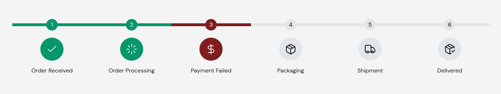
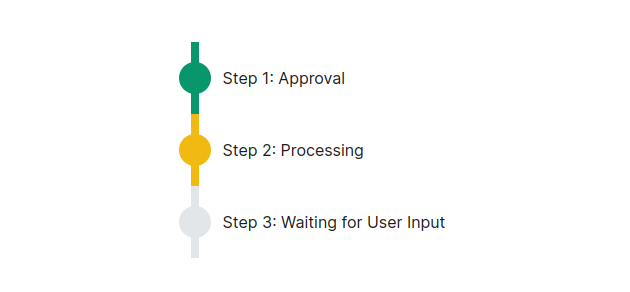

## ProcedureProgress Component

The `ProcedureProgress` component displays a series of progress steps in either a vertical or horizontal layout.

### Props:

| Name       | Type                       | Default    | Description                                                                                                                                                         | Required |
| ---------- | -------------------------- | ---------- | ------------------------------------------------------------------------------------------------------------------------------------------------------------------- | -------- |
| direction  | `vertical` \| `horizontal` | `vertical` | The direction of the progress steps. Can be `"vertical"` or `"horizontal"`. _On Mobile devices, it's forced to have `"vertical"` value to enhance user experience._ | Optional |
| showSerial | `boolean`                  | `true`     | Determines whether to show the serial numbers for the progress steps.                                                                                               | Optional |
| children   | `React.ReactNode`          |            | The progress steps to be displayed inside the `ProcedureProgress` component.                                                                                        | Required |

### Example Usage:

Make sure you've installed the [Lucide-icon](https://lucide.dev/icons/) package.

```jsx
import { ProcedureProgress } from './wels-components/ProcedureProgress/ProcedureProgress';
import { ProgressStep } from './wels-components/ProcedureProgress/ProgressStep';
import {
    Banknote,
    BookText,
    Building,
    Check,
    FilePenLine,
    TowerControl,
} from 'lucide-react';

<ProcedureProgress showSerial={true} direction="vertical">
	<ProgressStep status="approved" icon={<Check />}>
		Submitted
	</ProgressStep>
	<ProgressStep status="approved" icon={<Building />}>
		Department of Computer Science and Engineering
	</ProgressStep>
	<ProgressStep status="processing" icon={<TowerControl />}>
		Provost
	</ProgressStep>
	<ProgressStep status="waiting" icon={<BookText />}>
		Accounts Office
	</ProgressStep>
	<ProgressStep status="waiting" icon={<Banknote />}>
		Bank
	</ProgressStep>
	<ProgressStep status="waiting" icon={<FilePenLine />}>
		Exam Controller Office
	</ProgressStep>
</ProcedureProgress>
</div>
```



---

```jsx
import { ProcedureProgress } from './wels-components/ProcedureProgress/ProcedureProgress';
import { ProgressStep } from './wels-components/ProcedureProgress/ProgressStep';

<ProcedureProgress direction="horizontal" showSerial={false}>
    <ProgressStep status="approved">Step 1: Approval</ProgressStep>
    <ProgressStep status="processing">Step 2: Processing</ProgressStep>
    <ProgressStep status="waiting">Step 3: Waiting for User Input</ProgressStep>
</ProcedureProgress>;
```

<div align="center">
  
</div>

## ProgressStep Component

The `ProgressStep` component is used to display a progress step in a vertical or horizontal progression bar. It allows customization of the step's icon, status, serial number, and direction.

**Props:**

The `ProgressStep` component accepts the following props:
| Name | Type | Default | Description | Required |
|------------|-----------------------------|-------------|-----------------------------------------------------------------------------------------------------|----------|
| icon | `React.ReactElement` \| `null` | `null` | The icon to display for the step. | Optional |
| status | `approved` \| `waiting` \| `processing` \| `cancelled` | `processing` | The status of the step. | Required |
| serialNo | `string` | '' | The serial number of the step. | Optional |
| direction | `vertical` \| `horizontal` | `vertical` | The direction of the progress bar. | Optional |
| children | `React.ReactNode` | | The content to display for the step. | Required |

**Example Usage:**

> **Note:** Ensure that `ProgressStep` component is used as a child component of `ProcedureProgress` component to automatically generate serial numbers.

-   Using no icon

```jsx
<ProgressStep status="approved" serialNo="1">
    Step 1: Completed
</ProgressStep>
```

-   Using icon

```jsx
<ProgressStep icon={<CustomIcon />} status="waiting" serialNo="2">
    Step 2: In Progress
</ProgressStep>
```
