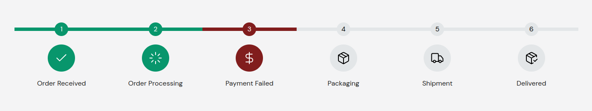

## Prerequisite

1. Ensure that you have [shadcn](https://ui.shadcn.com) installed in your project. If not, Follow the installation instruction [here](https://ui.shadcn.com/docs/installation).
2. Copy the theming information in the global css file. (updated)

```css
@tailwind base;
@tailwind components;
@tailwind utilities;

@layer base {
    :root {
        --background: 202 0% 100%;
        --foreground: 202 0% 10%;
        --card: 202 0% 100%;
        --card-foreground: 202 0% 15%;
        --popover: 202 0% 100%;
        --popover-foreground: 202 95% 10%;
        --primary: 202 80.3% 23.9%;
        --primary-foreground: 0 0% 100%;
        --secondary: 202 10% 90%;
        --secondary-foreground: 0 0% 0%;
        --muted: 164 10% 95%;
        --muted-foreground: 202 0% 40%;
        --accent: 164 10% 90%;
        --accent-foreground: 202 0% 15%;
        --destructive: 0 63% 31%;
        --destructive-foreground: 0 0% 100%;
        --success: 162 90% 31%;
        --success-foreground: 0 0% 100%;
        --warning: 45 89% 51%;
        --warning-foreground: 0 0% 100%;
        --border: 202 20% 82%;
        --input: 202 20% 50%;
        --ring: 202 80.3% 23.9%;
        --radius: 0.75rem;
    }
    .dark {
        --background: 202 10% 10%;
        --foreground: 202 0% 100%;
        --card: 202 0% 10%;
        --card-foreground: 202 0% 100%;
        --popover: 202 10% 5%;
        --popover-foreground: 202 0% 100%;
        --primary: 202 80.3% 23.9%;
        --primary-foreground: 0 0% 100%;
        --secondary: 202 10% 20%;
        --secondary-foreground: 0 0% 100%;
        --muted: 164 10% 25%;
        --muted-foreground: 202 0% 65%;
        --accent: 164 10% 25%;
        --accent-foreground: 202 0% 95%;
        --destructive: 0 63% 31%;
        --destructive-foreground: 0 0% 100%;
        --success: 162 90% 31%;
        --success-foreground: 0 0% 100%;
        --warning: 45 89% 51%;
        --warning-foreground: 0 0% 100%;
        --border: 202 20% 50%;
        --input: 202 20% 50%;
        --ring: 202 80.3% 23.9%;
        --radius: 0.75rem;
    }
}

@layer base {
    * {
        @apply border-border;
    }
    body {
        @apply bg-background text-foreground;
    }
}
```

3. Add the following in the `tsconfig.json` file. If the file does not exist, create it. In nextjs, `"jsx": "preserve"` will work fine. The `jsx` property specifies how TypeScript should handle JSX syntax in TypeScript files.

```json
{
    "compilerOptions": {
        // ....
        "jsx": "react-jsx"
        // ....
    }
}
```

4. Update the `tailwind.config.js` file.

```js
module.exports = {
    // ...
    content: [
        // ...
        "./location/to/the/submodule/**/*.{ts,tsx}",
        // ...
    ],
    // ...
    theme: {
        container: {
            center: true,
            padding: "2rem",
            screens: {
                "2xl": "1400px",
            },
        },
        extend: {
            colors: {
                // ...
                success: {
                    DEFAULT: "hsl(var(--success))",
                    foreground: "hsl(var(--success-foreground))",
                },
                warning: {
                    DEFAULT: "hsl(var(--warning))",
                    foreground: "hsl(var(--warning-foreground))",
                },
                // ...
            },
        },
    },
};
```

## Installation

1. Navigate to your project directory, preferably the `src` or `app` folder.

```bash
cd path/to/your/project/src
```

2. Add the GitHub repository as a submodule in your project. Replace `wels-components` with your desired folder name if you wish.

```bash
git submodule add https://github.com/voidCounter/wels-ui.git wels-components
```

## Usage

Let's use the `ProcedureProgress` component.

```jsx
import ProcedureProgress from "@/wels-components/ProcedureProgress/ProcedureProgress";
import ProgressStep from "@/wels-components/ProcedureProgress/ProgressStep";

<ProcedureProgress showSerial={true} direction="horizontal">
    <ProgressStep status="approved" icon={<Check />}>
        Order Received
    </ProgressStep>
    <ProgressStep status="approved" icon={<LoaderIcon />}>
        Order Processing
    </ProgressStep>
    <ProgressStep status="cancelled" icon={<DollarSign />}>
        Payment Failed
    </ProgressStep>
    <ProgressStep status="waiting" icon={<Package />}>
        Packaging
    </ProgressStep>
    <ProgressStep status="waiting" icon={<Truck />}>
        Shipment
    </ProgressStep>
    <ProgressStep status="waiting" icon={<PackageCheck />}>
        Delivered
    </ProgressStep>
</ProcedureProgress>;
```

Here is the component:


## Updating

When updating the submodule, navigate into the submodule directory (`wels-components`) and execute `git pull` to fetch the latest changes from the remote repository:

```bash
cd wels-components
git pull
```

## Contributing

Pull requests are welcome. Please open an issue first to discuss what you would like to change. More info will be added later.
